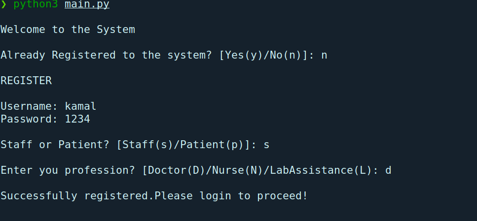
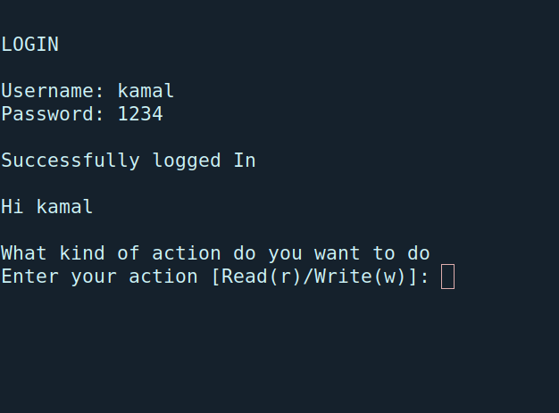
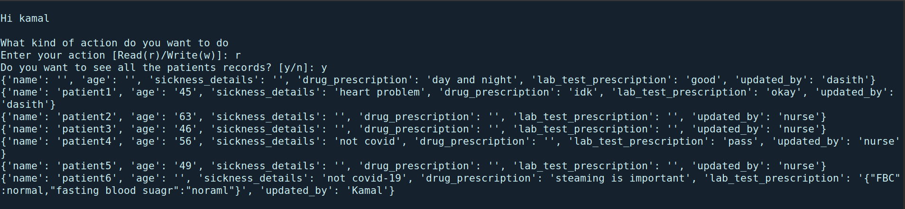
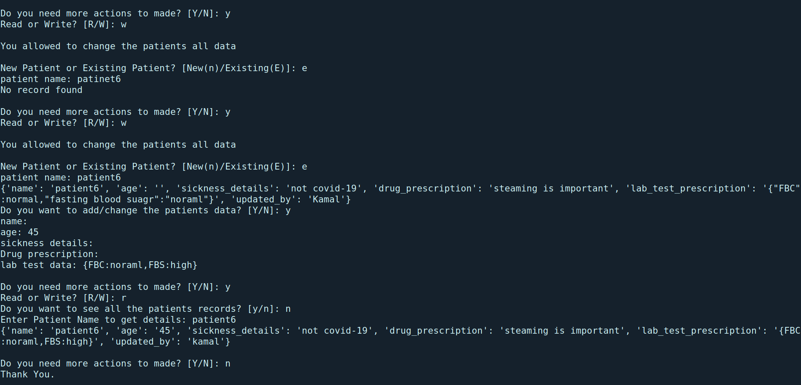

# Protection of information based on sensitivity and privilege levels

## Privilege Levels

#### 1 - Doctor
* Can modify any patients record
* Can read all patients data
* Can read data based on the patient name

#### 2 - Nurse
* Can Modify Personal Data of a Patient
* Cannot Modify any other records
* Can read all the patient data
* Can read data based on the patient name

#### 3 - Lab Assistant
* Can Modify Lab Prescription
* Other than that he/she cannot modify anything
* Can read all the data and based on the patient name

#### 4 - Patient
* Can read his/her data
* Cannot modify any of the data
* Even his data cannot modify
* Cannot read others data

## Sensitivity of Data
~~* All the data records are important.But in terms of medical perspective the sensitivity of
drug prescription and details of the sickness details are more important. So doctor has the 
privilege to modify and read those sensitive data.  

* Lab test also have higher amount of sensitivity. But most of the lab works are done by lab assistance,
modification rights of lab test data has to given to the lab assistance as well. So for lab test data both 
lab assistant and the doctor has the privilege.
* For modification of the personal data, nurse and the doctor has the access. Patient him self has no access to
modify his/him data. 
* Patient can see their record. But cannot modify. Even patients cannot see others data.~~

### Workflow
#### Register

#### login

#### Read data

#### Update

* Here when user enters wrong username system will detect it and alert him.
* Registered user is a doctor. He has access to read and modify all the data